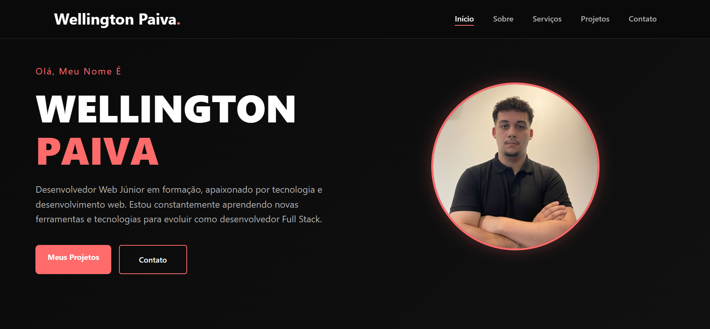

# 💻 Portfólio - Wellington Vinicius

Bem-vindo ao meu portfólio de desenvolvedor web! 🚀

---

## 🌐 Acesse o site
🔗 https://wellington-vinicius.github.io/portfolio/

---

## 🚀 Tecnologias utilizadas

- HTML5  
- CSS3  
- JavaScript  
- Git e GitHub  

---

## 📂 Sobre o projeto

Este projeto foi desenvolvido para apresentar meus conhecimentos em desenvolvimento web e meus primeiros projetos.

---

## 📞 Contato

📧 Email: wellingtoncoelhopaiva@gmail.com  
🔗 LinkedIn: https://www.linkedin.com/in/wellington-paiva-b34375304  
🐙 GitHub: https://github.com/wellington-vinicius  

---

## 🎯 Objetivo

Busco minha primeira oportunidade como desenvolvedor front-end, com foco em aprender, evoluir minhas habilidades e contribuir com projetos reais.

---

⭐ Se gostou do projeto, deixe uma estrela!